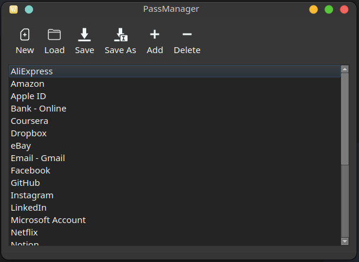
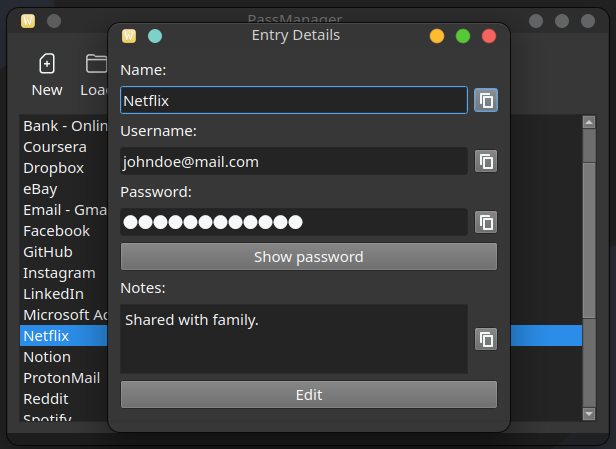
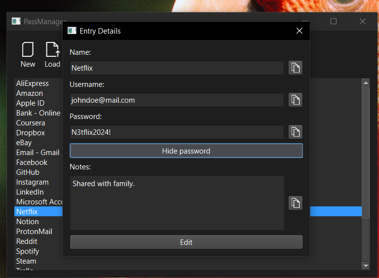
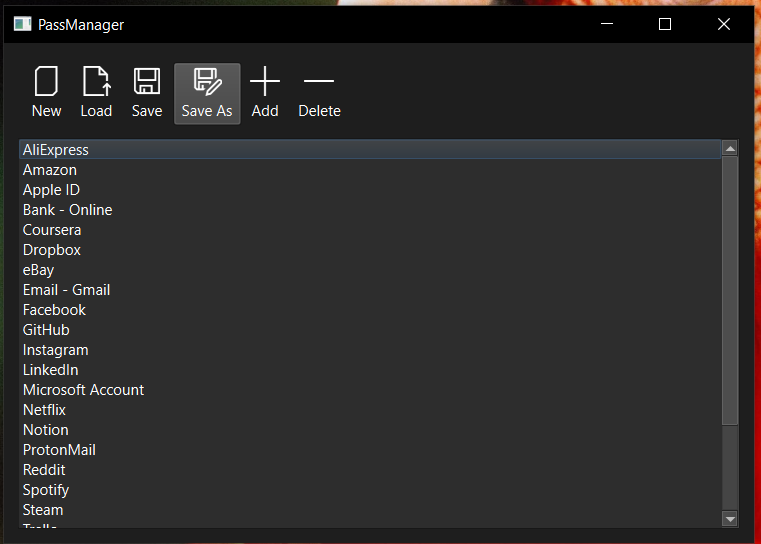

# PassManagerGUI

**PassManagerGUI** is a secure and user-friendly password manager with a graphical interface. It allows you to store and manage your passwords locally in an encrypted `.pass` file format. Designed with simplicity and privacy in mind, this app keeps your credentials safe without relying on the cloud.

✅ Cross-platform: Works on **Windows**, **Linux**, and **macOS** thanks to the use of **PyQt6**.

---

## 📸 Screenshots

### 🐧 Linux

### 🪟 Windows

---

## 🚀 Features

- Clean and intuitive PyQt6-based GUI
- Secure password encryption and local storage
- No internet or cloud dependency
- Easy-to-use interface for adding, editing, and removing entries

---